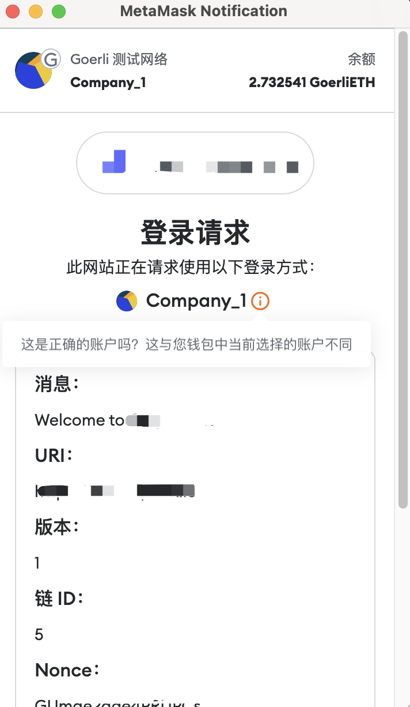

# Onboard vue hooks

_@onboard/vue 的二次封装_

## 安装

```bash
yarn add onboard-vue-hooks

# 必须包含的依赖
# @web3-onboard/core @web3-onboard/vue ethers siwe vue
```

## 读写操作

**根据当前链接的钱包的进行读写操作**

```typescript
import { watch, ref } from "vue";
import { Contract } from "ethers";
import { useSigner, useBrowserProvider, WalletError } from "onboard-vue-hooks";

const abi = [
  {
    inputs: [
      { name: "owner", type: "address" },
      { name: "spender", type: "address" },
    ],
    name: "allowance",
    outputs: [{ name: "", type: "uint256" }],
    stateMutability: "view",
    type: "function",
  },
  {
    inputs: [
      { name: "spender", type: "address" },
      { name: "amount", type: "uint256" },
    ],
    name: "approve",
    outputs: [{ name: "", type: "bool" }],
    stateMutability: "nonpayable",
    type: "function",
  },
];
const address = "0x...";
const erc20TokenAddress = "0x...";
const contractAddress = "0x...";

const useEthereumIfWithout = false;
const { browserProvider } = useBrowserProvider(useEthereumIfWithout);

// 读取操作
const allowance = ref<bigint>(BigInt(0));
watch(
  browserProvider,
  async (provider) => {
    if (provider) {
      const contract = new Contract(erc20TokenAddress, abi, provider);
      allowance.value = await contract.allowance(address, contractAddress);
    }
  },
  { immediate: true }
);

// 写操作
const { getSigner } = useSigner();
const onClickApprove = async (needSpend: bigint) => {
  if (allowance.value >= needSpend) return;
  try {
    const signer = await getSigner();
    const contract = new Contract(erc20TokenAddress, abi, signer);
    await contract.approve(contractAddress, needSpend);
  } catch (error) {
    const _error = error as WalletError;
    if (_error.code === "UNCONNECTED_WALLET") {
      alert("请链接钱包");
    }
  }
};
```

## 登录签名

```typescript
import { useSigner, useSiweMessage, WalletError } from "onboard-vue-hooks";

const getNonce = async () =>
  ""; /** 从后台获取 nonce，用于防止重放攻击的随机令牌，至少8个字母数字字符 */

// 登录
const { signMessage } = useSigner();
const { createMessage } = useSiweMessage();
const onClickLogin = async () => {
  try {
    const nonce = await getNonce();
    const signature = await signMessage(await createMessage({ nonce }));
    console.log(signature);
  } catch (error) {
    const _error = error as WalletError;
    if (_error.code === "UNCONNECTED_WALLET") {
      alert("请链接钱包");
    }
  }
};
```


